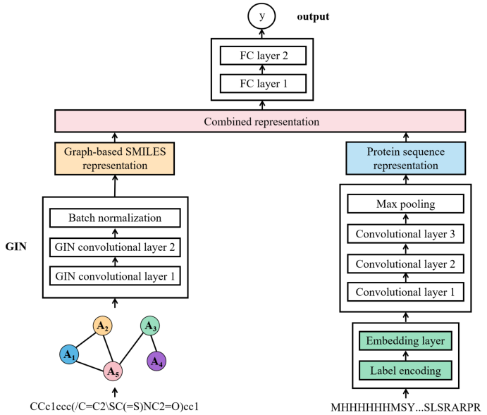
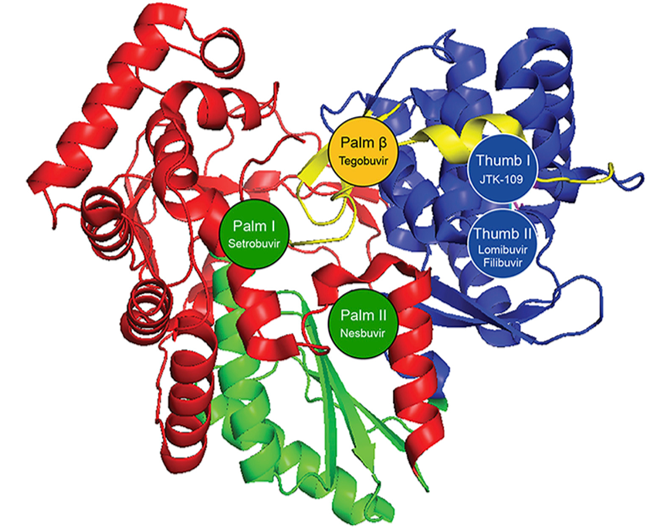

---

### Research Experiences

**Studies on the Influence of Lifestyle Factors on Mild Cognitive Impairment in Aging Populations**

Sep 2024 - Nov 2024

- Performed descriptive data analysis on UK Biobank participants aged 50+, utilizing polychoric and polyserial correlations to explore relationships between lifestyle factors, other confounders and MCI
- Calculated and quantified lifestyle indices for physical activity, diet quality, alcohol misuse, and smoking, such as AUDIT-C
- Applied Cox proportional hazards models to analyze mortality risk, mixed-model repeated-measures analysis for health outcomes across multiple time points, and sensitivity analyses
- Data Source: [UK Biobank](https://biobank.ndph.ox.ac.uk/ukb/browse.cgi?id=-2)

**Studies on the Prediction of Biological Activity of RDRP Inhibitors Based on Deep Learning**           

Jan 2023 - May 2023

- Based on Graph Neural Networks in deep learning methods, constructed a small molecule inhibitory activity classification model against RDRP, and increased the training and testing accuracy to more than 90%
- Used P2Rank model to predict the binding pockets with more than 18,000 in the laboratory molecular library, and found more than 3 novel pockets each in HCV 1b, DENV 2 and SARS-CoV-2 RDRP
- Screened out 722 molecules with novel binding sites and high inhibitory activity, clustered these molecules to find molecular skeletons with Morgan Fingerprints, such as 4-Biphenylacetic acid

  
  

 

**The Status Quo of China’s Pharmaceutical Industry-Based on the Covid-19 Vaccine**                 

Jan 2022 - Apr 2022

- Designed online questionnaire to collect information reflecting people’s knowledge of COVID-19, and the personal profile, vaccinate rate, willingness, and influencing factors, and obtained 566 pieces of valid questionnaires with indexes including gender, region, urban and rural areas, age, occupation, education, vaccination situation, and scored people’s willingness for vaccination
- Conducted T-test and ANOVA to investigate several significant factors affecting vaccination willingness, such as age, education, convenience and cognition of vaccine safety
- Applied multiple logistical regression model and optimized model performance through stepwise selection and regularization techniques to predict vaccination probabilities in a population

 

---

### Skills

- **Software and Programming Languages: **
  - MS Office (Word, Excel, PowerPoint)
  - R
  - SAS
  - Python
  - STATA
  - SQL
  - SPSS
  - C++
- **Technical Skills:**
  - Regression (Linear, GLM, GEE)
  - Machine Learning Models (Random Forest, K-Means)
  - EDA
  - Cross Validation
  - PCA
  - Survival Analysis

