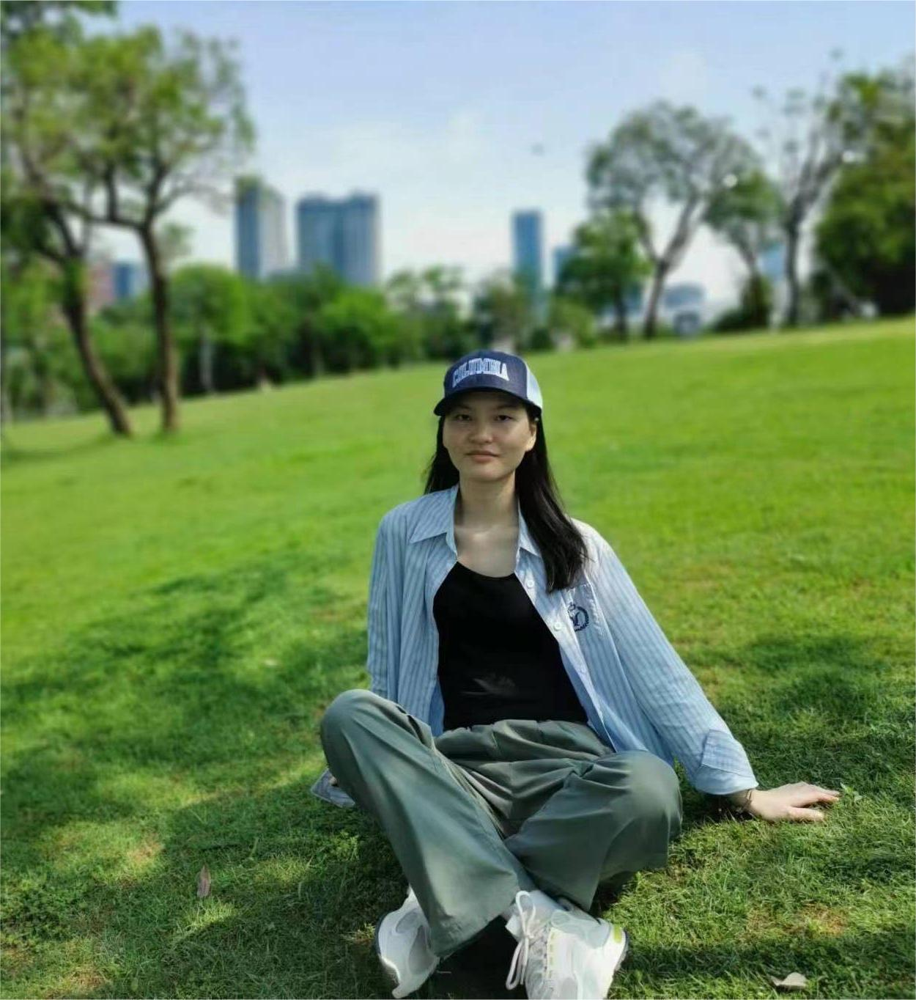

---

### About me

I'm currently a 2nd-year Master's student in Biostatistics at Columbia University, holding a Bachelor's degree in Pharmacy from Tsinghua University.

I'm actively seeking data analysis-related opportunities, and eager to apply my statistical skills in real-world settings!

 

---

### Education

**Columbia University, New York, United States (Sep 2023 - May 2025 expected)**

*MPH in Biostatistics, Mailman School of Public Health*

**Courses:** 

- Survival Analysis
- Data Science
- Statistical Computing with SAS
- Epidemiology
- Applied Time Series Analysis

**Tsinghua University, Beijing, China (Aug 2019 - Jun 2023)**

*BSc in Pharmaceutical Sciences, Minor in Statistics, School of Pharmaceutical Sciences*  

**Courses:** 

- Pharmacology
- Toxicology
- Pharmacokinetics
- Molecular Biology

Throughout my academic learning, I have developed a strong foundation in `R`, `Python`, `SAS`, `STATA`, `SQL` and `C++`.

 

---

### Experience

- [Academic](academic.html)

 

---

### Courses

- [P8105.Data Science](ds1.html)
- P8110.Survival Analysis
- P8107.Intro to Math
- P8400.Epidemiology

