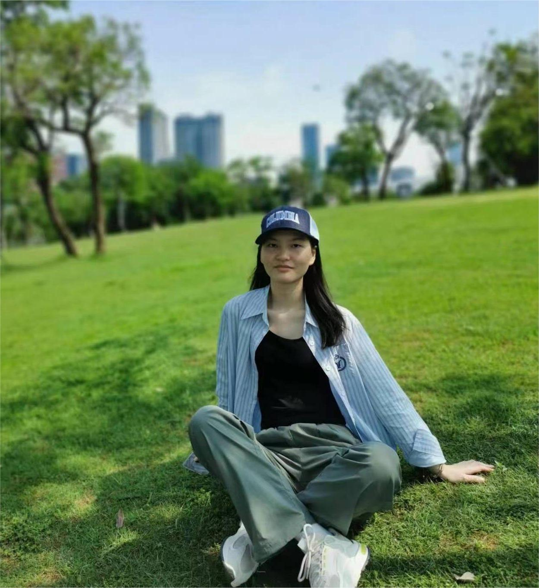

### About me

I'm currently a 2nd-year master's student in Biostatistics at Columbia University. 

Throughout my academic learning, I have developed a strong foundation in SAS, R, Python programming and statistical methods.

### Experience

* [Academic](academic.html)

### Homework #4

* [Dashboard](dashboard.html)

